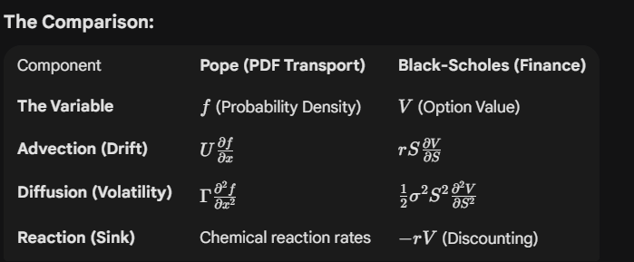
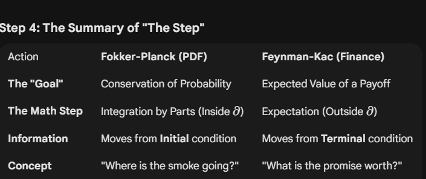
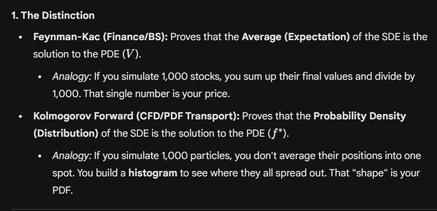
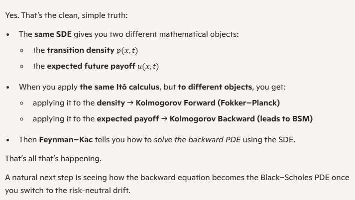

That is a sophisticated and clever choice for a CFD course. You are essentially bridging the gap between stochastic financial modeling and computational fluid mechanics by treating "price" as a coordinate and "probability" as a conserved fluid.

Since you are aiming for two pages tomorrow, here is a concise breakdown of how these two worlds collide to help frame your extended abstract and literature review.

The Core Connection: The "Fluid" of Probability
In CFD, we often use the Transported Probability Density Function (PDF) method to model turbulent combustion. In finance, the Black–Scholes–Merton (BSM) model describes how the probability distribution of an option's price evolves over time.

Both rely on a version of the Fokker-Planck equation (or Kolmogorov Forward Equation). Mathematically, the BSM equation can be viewed as a convection-diffusion equation where:

Convection (Drift): Represents the risk-neutral return.

Diffusion (Volatility): Represents the market's random fluctuations (Brownian motion).

1. Extended Abstract Strategy
Your abstract should highlight that while BSM is traditionally viewed through the lens of "hedging," it is physically a parabolic partial differential equation (PDE).

The Problem: Analytical solutions for BSM only exist for simple cases.

The CFD Solution: For complex derivatives (like "Path Dependent" options), we use numerical schemes like Finite Difference Methods (FDM) or Monte Carlo simulations, which are the bread and butter of CFD.

2. Brief Literature Review Themes
To show depth, your review should mention these three pillars:

The Originators: Black, Scholes, and Merton (1973) for the initial PDE derivation.

The CFD Bridge: Reference the work of Patankar or Spalding regarding the discretization of transport equations, noting how their stability criteria (like the CFL condition) apply to financial grids.

The PDF Method: Mention Pope (1985), who popularized the transported PDF method in fluid mechanics, and note how his Lagrangian particles are analogous to "Monte Carlo paths" in finance.

3. Expected Contents for the Final Paper
In this section of your submission, you might want to promise the following:

Derivation: Showing the transformation of the BSM equation into a standard heat-transfer-style transport equation.

Numerical Implementation: A comparison between a Crank-Nicolson scheme (often used in CFD) and a standard Black-Scholes analytical result.

Stability Analysis: Discussing how "volatility" acts as a diffusion coefficient and how that affects the numerical stability of the financial model.

Why you can skip Patankar/Spalding:
Pope already covers the stochastic differential equations (SDEs) and the Monte Carlo particle methods that directly mirror how BSM is solved in practice.

Shreve provides the derivation from SDEs to PDEs (the Feynman-Kac theorem), which is the mathematical "bridge" you need.

Cite Pope (1985): For providing the framework of "Transported PDFs," which allows us to treat uncertain variables as a fluid-like substance.

Cite Shreve: For the rigorous proof that a random "jittery" process (Stochastic Calculus) can be transformed into a smooth "Transport Equation" (The Feynman-Kac Theorem).

What to put in your "Expected Contents" paragraph:
Since this is for a CFD course, your professor wants to see CFD techniques applied to finance. You should state that your final paper will:

Map the BSM parameters directly onto the Navier-Stokes transport terms.

Analyze the "Stability" of financial models using CFD concepts like the CFL Condition (ensuring your time-steps aren't too big for your "price-steps").

Explore how "Monte Carlo" particle methods from Pope's work are used to price complex Wall Street derivatives.

Yes, exactly. This is the "bridge" where Brownian Motion (the chaos) turns into a Transport Equation (the smooth math).
Here is the breakdown of how that works:
1. The Brownian Motion (The "Jitter")
Shreve explains that a stock price follows a "Random Walk" or Brownian Motion. In math, we call this a Stochastic Differential Equation (SDE). It looks like this:
    • The Drift: The stock's steady climb.
    • The Noise: The random, jittery jumps (Brownian Motion).
In CFD terms, this is like watching a single microscopic particle of smoke get kicked around by air molecules. It is chaotic and unpredictable.
2. The Feynman–Kac Theorem (The "Smoothness")
This is the magic trick of the paper. This theorem proves that if you stop looking at the single jittery particle and start looking at the average of all possible particles, the chaos disappears.
The "average" behavior of millions of random paths creates a smooth, predictable curve. That curve is governed by a Transport Equation (a PDE).
3. Why this matters for your 2-page paper
You can use this to link your sources together perfectly:
    • The Physics: Brownian Motion is how fluid particles move in turbulence (Pope).
    • The Finance: Brownian Motion is how stock prices move in the market (Shreve).
The Synthesis: The Feynman–Kac Theorem is the mathematical proof that allows us to use CFD "Transport" math to solve "Jittery" finance problems.

Pope focuses on the Fokker-Planck Equation (also known as the Kolmogorov Forward Equation).
    • The Connection: The Feynman-Kac theorem and the Fokker-Planck equation are two sides of the same coin. Fokker-Planck (Pope) tracks how the probability flows forward; Feynman-Kac (Shreve) tracks how the expected value flows backward.
    • In your paper, you can say: "While Pope (1985) utilizes the Fokker-Planck framework for forward PDF transport, this study utilizes the Feynman-Kac theorem as described by Shreve (2004) to bridge these fluid methods with financial option pricing."

PDF Transport (The Forward View)
    • The Question: Where is the "cloud" going?
    • The Direction: You start with a known state at $t=0$ and move forward in time.
    • The Equation: This is the Fokker-Planck equation (which Pope uses). It tracks how the probability "leaks" and "drifts" into the future.
    • CFD Context: You are predicting the concentration of a pollutant as it travels downwind.
2. Black-Scholes (The Backward View)
    • The Question: What is the value today?
    • The Direction: You know the value at the expiration date $T$ (the "Final Condition"). You solve the equation backward to $t=0$.
    • The Equation: This is a Kolmogorov Backward Equation.
Finance Context: You are "discounting" the future possibilities to find a single fair price today.

In your paper, the "bridge" is that both use the same mathematical engine. If you take the Black-Scholes equation and perform a "change of variables" (a math trick to flip the time), it becomes the exact same equation Pope uses to move fluids forward.

1. The Stochastic Foundation (The "Jitter")
Concept: Both fluids and stocks move with a mix of predictable trends and random chaos.

Term: Brownian Motion (or Wiener Process).

Key Source: Shreve defines this for finance; Pope defines it for fluid particles.

The Analogy: A stock price jumping is mathematically identical to a microscopic fluid particle being kicked by turbulence.

2. The Transport Equation (The "Engine")
Concept: A mathematical formula that describes how a "cloud" of something (smoke, heat, or probability) moves and spreads.

Components: * Convection/Drift: The "wind" pushing the cloud.

Diffusion/Volatility: The random "spreading out" of the cloud.

The Logic: Instead of tracking one particle/stock price, we track the whole Probability Density Function (PDF).

3. The Feynman–Kac Theorem (The "Bridge")
Concept: The specific mathematical proof that connects the "Jitter" (Step 1) to the "Engine" (Step 2).

Function: It allows you to take a random, unpredictable path (Stochastic) and turn it into a smooth, solvable equation (Partial Differential Equation).

Key Source: Shreve.

4. Forward vs. Backward Modeling (The "Direction")
Forward (Pope/CFD): You know the state now and predict the "cloud" in the future. (Fokker-Planck Equation).

Backward (Black-Scholes): You know the "payout rule" at expiration and calculate the value today. (Kolmogorov Backward Equation).

The Link: By flipping the time variable, the BSM equation becomes a standard CFD transport equation.

5. Numerical Solvers (The "Application")
Concept: Since we can’t always solve these equations with pen and paper, we use computers.

Methods: * Monte Carlo: Simulating thousands of random "paths" (common in both Pope and Finance).

Finite Difference: Using a grid to solve the transport equation (Standard CFD).

Shreve/Black-Scholes use the Feynman-Kac (FK) Theorem: They use it to go from the random "jitter" of the stock market to a Backward equation to find a price today.

Pope/CFD uses the Fokker-Planck Equation: He uses it to go from the random "jitter" of fluid molecules to a Forward equation to find a probability in the future.

The "Same House" Analogy
Think of the math as a two-way street.

The Fokker-Planck Equation (Pope) is the Forward lane. It tells you how a "cloud" of probability moves into the future.

The Feynman-Kac Theorem (Shreve) is the Backward lane. It tells you how the "expected value" of that future cloud relates to the value you have right now.

Why this is a "Bridge" for your paper
In your term paper, you aren't saying they are identical; you are saying they are Adjoints (mathematical twins).

Both Fokker-Planck (FP) and Feynman-Kac (FK) are mathematical tools that take a "jittery" SDE and tell you: "Stop trying to track the individual random jumps; just solve this smooth PDE (Transport Equation) instead."The only real difference is the perspective of the solution:1. The Fokker-Planck Perspective (Pope / CFD)The Goal: Track the Probability Density Function (PDF).The Logic: If I have a bunch of random particles (SDE), how does the "cloud" of their locations evolve?The Result: A Forward Transport Equation. It tells you where the probability is flowing into the future.Use in your paper: Use this to reference Pope, who uses it to see how temperatures or velocities "spread out" in a turbulent engine.2. The Feynman-Kac Perspective (Shreve / Finance)The Goal: Calculate an Expected Value.The Logic: If I know the final payout of a random stock path (SDE), what is the average value of all those paths weighted together today?The Result: A Backward Transport Equation. It starts at the future "payout" and flows back to the present.Use in your paper: Use this to reference Shreve, who uses it to prove that the Black-Scholes PDE is the solution to the "jittery" movement of a stock.The Comparison Table for your 2-page DraftThis table is a great way to fill space and show the professor you've done the "mapping" between the two fields:ComponentThe "Jittery" Source (SDE)The "Smooth" Solution (PDE)Common NameLangevin Equation / Random WalkTransport EquationFinance ToolBrownian Motion of StockFeynman-Kac $\rightarrow$ Black-ScholesFluid ToolTurbulent Particle PathFokker-Planck $\rightarrow$ Transported PDFPhysical MeaningIndividual particle/asset movementEvolution of the "Cloud" (Value/Prob)

Since we’ve nailed the "Big Idea" (the SDE-to-PDE bridge), what’s missing from your abstract is the Technical Connective Tissue.
Your professor isn't just looking for a cool analogy; they want to see that you know which specific knobs and dials from a CFD simulation correspond to the knobs and dials of a financial model.
Here are the three things you should add to your abstract to make it bulletproof:

1. The "Mapping" of Variables
You need to explicitly state that you are treating the Stock Price as a Spatial Dimension.
    • In CFD, you move through $x, y, z$.
    • In your paper, the "Grid" is the Stock Price ($S$).
    • Mention that the Options Value is the Scalar being transported (like temperature or a chemical species).
2. Numerical Discretization (The "How")
A CFD abstract needs to mention how you’re going to solve it. Since you’re using Pope, you have two choices to mention:
    • Eulerian Methods: Solving on a fixed grid (like a "Finite Difference" scheme). This is how you'd solve the Black-Scholes PDE directly.
    • Lagrangian Methods: Using "Notional Particles" (Monte Carlo). This is what Pope is famous for—simulating thousands of random "particles" to see where the probability cloud goes.
    • Tip: Say your paper will compare these two.
3. Stability and Constraints (The "CFD Discipline")
Professors love this. Mention that you will examine the CFL Condition (Courant–Friedrichs–Lewy).
    • In CFD, if your fluid moves faster than your grid can handle, the simulation "explodes."
    • In Finance, if the stock Volatility is too high compared to your Time Step, your price calculation will fail. Mentioning "numerical stability" makes this a true Engineering paper.

Revised "Expected Contents" Outline for your Abstract:
If you include these bullets in your 2-page draft, you’ll look like an expert:
    • Derivation of the Mathematical Duality: Using the Feynman-Kac Theorem to map the Black-Scholes PDE onto a standard Advection-Diffusion transport equation.
    • Variable Correlation: Mapping financial Drift to fluid Advection and market Volatility to Diffusion.
    • Numerical Implementation: A comparison of Finite Difference (Grid-based) vs. Monte Carlo (Particle-based) solvers for pricing European options.
    • Stability Analysis: Evaluating the CFL condition and its impact on the convergence of financial "price-grids."

One Final Check: The "Why"
Make sure your abstract answers: Why do we care?
The Answer: Because CFD solvers are incredibly fast and optimized for high-performance computing. By proving the BSM is a transport equation, we can use 50 years of CFD research to price complex financial products faster and more accurately than traditional bank models.

In Pope, you see the vector form (using $\nabla \cdot$ or $\frac{\partial}{\partial x_i}$) because fluids move in 3D space ($x, y, z$) and have multiple velocity components. In Finance, your "space" is 1D (the stock price $S$).The reason it "doesn't matter" for your argument is exactly what you said: The transformation mechanism is universal.1. The Transformation is the "Star" of your PaperWhether it's a 1D stock price or a 3D turbulent jet, the mathematical jump is the same:Step A: You start with a Langevin Equation (SDE). This describes the "jittery" path of a single particle or a single stock.Step B: You apply the transformation (Feynman-Kac for finance, Fokker-Planck for Pope).Step C: You arrive at a Transport Equation (PDE).2. Why the Vector Form in Pope actually helps youYou can actually use the fact that Pope uses a vector form to show that the Black-Scholes model is a simplified version of Pope’s work.In Pope, the "space" is $\mathbf{x} = [x, y, z]$.In Black-Scholes, the "space" is just $S$.By citing Shreve, you show the 1D derivation. By citing Pope, you show that this 1D financial problem is just a subset of a much larger, multi-dimensional fluid transport framework.

Stochastic Differential Equations.Whether you are looking at a particle in a jet engine or a stock on the NYSE, the "recipe" for their movement is the same:$$\text{Change in State} = (\text{Deterministic Trend}) \cdot dt + (\text{Random Noise}) \cdot dW_t$$

2. The Only "Physical" DifferenceThe only reason they look slightly different in the books is how the noise behaves:In Pope (Additive Noise): The "kick" the particle gets from turbulence is often treated as constant. It doesn't matter if the particle is at $x=1$ or $x=100$; the air hits it just as hard.In Shreve (Multiplicative Noise): The "kick" the stock gets is proportional to its price. If a stock is $\$100$, a $1\%$ move is $\$1$. If it's $\$1,000$, a $1\%$ move is $\$10$. The noise "scales" with the price.3. Why this is the "Smoking Gun" for your PaperBecause both start as this specific type of SDE, they both have the right to be transformed into a Transport Equation (PDE).The Fokker-Planck Equation takes Pope's SDE and turns it into a Forward Transport Equation (where is the smoke going?).The Feynman-Kac Theorem takes Shreve's SDE and turns it into a Backward Transport Equation (what is the value today?).

. The BSM SDE (Finance)In the Geometric Brownian Motion model used by Shreve, the "kick" is proportional to the current price:$$dS_t = \underbrace{r S_t dt}_{\text{Trend (Drift)}} + \underbrace{\mathbf{\sigma S_t dW_t}}_{\text{The "Kick" (Diffusion)}}$$The Highlight: Notice the $S_t$ inside the kick.Why it's "Multiplicative": If the stock price ($S_t$) is $\$10$, a random $1\%$ shove ($dW_t$) is only $\$0.10$. If the price is $\$1,000$, that same $1\%$ shove is $\$10$. The "kick" scales with the price.Physical Result: This creates the Log-normal distribution (the "cloud" spreads faster as it moves to higher prices).2. The Pope SDE (Fluids)In the Langevin equation used by Pope for a particle property (like velocity or position), the "kick" is usually modeled as a constant intensity of turbulence:$$dx^*_t = \underbrace{\tilde{U} dt}_{\text{Trend (Advection)}} + \underbrace{\mathbf{\sqrt{2 \Gamma} dW_t}}_{\text{The "Kick" (Diffusion)}}$$The Highlight: The term $\sqrt{2 \Gamma}$ is typically a constant (representing the fluid's diffusivity).Why it's "Additive": The air molecules don't care where the particle is; they hit it with the same statistical force regardless of its position ($x$).Physical Result: This creates a standard Gaussian (Bell Curve) distribution (the "cloud" spreads at a constant rate).3. How the "Kick" enters the PDEWhen you use the Feynman-Kac or Fokker-Planck bridge to turn these into a smooth transport equation, the "Kick" becomes the Second-Order Derivative term (the Diffusion term):In Finance (BSM): The kick becomes $\frac{1}{2} \sigma^2 S^2 \frac{\partial^2 V}{\partial S^2}$.In Fluids (Pope): The kick becomes $\Gamma \frac{\partial^2 f}{\partial x^2}$.

1. Where to find the Pope SDEIn Pope (1985), Progress in Energy and Combustion Science, or his textbook Turbulent Flows (2000), look for the Langevin Equation.Location: In the 1985 paper, look at Section 3 (The PDF Transport Equation).The Form: He often writes it for a "scalar" $\phi$ (like temperature or a chemical species) or for velocity $U^*$.What to look for: Look for an equation that looks like this:$$d\phi^* = C(\dots)dt + [2\epsilon \dots]^{1/2} dW$$Pope’s Context: He uses this to describe how a "notional particle" moves through a turbulent field. The "kick" here represents the molecular diffusion or the sub-grid turbulence hitting that particle.

2. Where to find the Black-Scholes SDEIn Shreve (2004), Stochastic Calculus for Finance II, this is the absolute bread and butter of the first few chapters.Location: Look at Chapter 3 (Brownian Motion) or Chapter 4 (Stochastic Calculus). Specifically, look for Definition 3.3.2 or the section on Geometric Brownian Motion (GBM).The Form: $$dS(t) = \alpha S(t) dt + \sigma S(t) dW(t)$$Shreve’s Context: He uses this to define the "Risk-Neutral" price path. This is the SDE that serves as the "input" for the Feynman-Kac Theorem.

3. How to Cite the "Transformation"This is the most important part of your paper. You aren't just citing two random equations; you are citing the link between them.For Pope: Cite the Fokker-Planck (or Kolmogorov Forward) link. Pope shows that the SDE for his particles results in the PDF Transport Equation (a PDE).For Shreve: Cite the Feynman-Kac link. Shreve shows that the SDE for the stock price results in the Black-Scholes Equation (a PDE).

This is the "Grand Map" of your paper. We will walk through the four stages that both Pope (CFD) and Shreve (Finance) follow. They use different dialects, but they are following the exact same mathematical recipe.Step 1: The Core Philosophy (The "Physics")Before writing an equation, you define how a single unit (a particle or a stock) moves.In CFD (Pope): A fluid particle moves due to the average wind (Advection) plus the chaotic bumping of turbulence (Diffusion).In Finance (Shreve): A stock price moves due to its average expected return (Drift) plus the chaotic jumping of the market (Volatility).The Similarity: Both assume that "Today + a tiny bit of time" equals "Today's value + a predictable trend + a random shock."Step 2: Building the SDE (The "Micro" View)Now we write the "Jittery" equation for that single unit. This is a Langevin-style SDE.Pope’s SDE: $$dx^*_t = \underbrace{U dt}_{\text{Advection}} + \underbrace{\sqrt{2\Gamma} dW_t}_{\text{Diffusion (Kick)}}$$Shreve’s SDE: $$dS_t = \underbrace{\mu S_t dt}_{\text{Drift}} + \underbrace{\sigma S_t dW_t}_{\text{Volatility (Kick)}}$$The Similarity: Both use $dW_t$ (Brownian Motion/Wiener Process) to represent the "kick." The only difference is that the financial kick scales with the price ($S_t$), while the fluid kick is often constant ($\sqrt{2\Gamma}$).Step 3: The Transformation (The "Bridge")We stop tracking one particle/stock and start tracking the entire cloud. This is where the magic happens. We transform the SDE into a Partial Differential Equation (PDE).Pope (Fokker-Planck): He uses the Forward Kolmogorov Equation to show how the Probability Density Function (PDF) spreads out into the future.Shreve (Feynman-Kac): He uses the Feynman-Kac Theorem to show how the "Expected Value" of the future payout flows backward to give us a price today.The Similarity: Both transformations result in a Transport Equation. If you look at the BSM PDE and the Transported PDF PDE, they both have a time derivative, a first-order derivative (advection), and a second-order derivative (diffusion).Step 4: Solving the Equation (The "Computation")Since these PDEs are hard to solve with a pen, we use computers.Numerical Method A (The Grid): You build a mesh. In CFD, it’s a grid of the room; in Finance, it’s a grid of stock prices ($S$). You use Finite Difference (like Crank-Nicolson) to see how values move from cell to cell.Numerical Method B (The Particles): This is Monte Carlo. Instead of the PDE, you go back to Step 2 and simulate 100,000 "jittery" paths, then average them.The Similarity: Pope is famous for saying that "Particle Methods" (Monte Carlo) are better for complex fluids because they handle the "random kicks" more naturally. Finance uses Monte Carlo for the exact same reason—to handle complex "kicks" in the market.

To give you the level of detail needed for a 2-page technical paper, we need to look at the exact mathematical operators that move us from the "jittery" world of particles to the "smooth" world of PDEs.Here is the deep dive into the four-step process, focusing on the specific calculus that connects Pope and Shreve.Step 1: The Micro-Physics (The SDE)We start with the "Langevin" form. This is the "Micro" view of a single entity.Fluid Particle (Pope):$$dx^*_t = U(x^*_t, t)dt + \sqrt{2\Gamma} dW_t$$Here, $x^*$ is the position. The change in position is the velocity ($U$) plus a random thermal or turbulent "kick" ($\Gamma$).Stock Price (Shreve):$$dS_t = r S_t dt + \sigma S_t dW_t$$Here, $r$ is the risk-free interest rate (the drift). Note the multiplicative nature: the $S_t$ is attached to both terms. This means the "speed" and "jitter" of the stock depend on its current price.Step 2: The Bridge (The Transformation)This is the most technical part of your paper. How do we turn those $dW$ "kicks" into a smooth derivative ($\partial$)?The Tool: Itô’s Lemma.The Logic: In standard calculus, $dx^2$ is so small we ignore it. In Stochastic Calculus, $(dW)^2 = dt$. This "extra term" is exactly what creates the Diffusion term in a PDE.The Result: * Pope uses the Fokker-Planck Equation to find the Probability Density $f(x, t)$.Shreve uses the Feynman-Kac Formula to find the Option Value $V(S, t)$.Step 3: The Macro-Equation (The PDE)Now we look at the resulting "Transport Equations." This is where the CFD and Finance worlds look identical.The Generic Transport Equation:$$\frac{\partial \phi}{\partial t} + \underbrace{A \frac{\partial \phi}{\partial x}}_{\text{Advection}} + \underbrace{B \frac{\partial^2 \phi}{\partial x^2}}_{\text{Diffusion}} = \underbrace{C}_{\text{Source/Sink}}$$

The key detail for your paper: In Finance, the Advection and Diffusion coefficients ($rS$ and $\sigma^2 S^2$) are functions of the space variable $S$. In basic CFD, velocity and diffusivity are often constant. This makes Black-Scholes a "Variable Coefficient" transport problem.Step 4: The Solution (Numerical Implementation)How do we actually get a number? This is the "Engineering" part.Lagrangian (Particle-Based): * This is what Pope advocates for. You "release" 10,000 computational particles. Each one follows the SDE from Step 1.In Finance, this is Monte Carlo Simulation. You simulate 10,000 stock paths, calculate the payout for each at the end, and average them.Similarity: Both avoid the "curse of dimensionality." If you have 50 stocks (or 50 chemical species), a grid is too slow, but particles are fast.Eulerian (Grid-Based): * You build a mesh of stock prices from $\$0$ to $\$200$.You use Finite Difference (like the Crank-Nicolson scheme) to step through time.Similarity: Just like a CFD mesh, you must worry about the CFL Condition. If your $\Delta t$ is too big, the "information" moves across your price-grid faster than the math can track, and the simulation "blows up."Summary of the "Detail" for your 2-Page Draft:To reach the page count, emphasize the Itô Calculus as the bridge. Explain that the reason we can treat a stock like a fluid is that Itô’s Lemma allows us to take a "jittery" random walk and extract a "smooth" diffusion coefficient.

In a formal CFD or Financial Engineering paper, the "meat" of the document is showing exactly how the stochastic "jitter" of a particle (SDE) is mathematically condensed into a smooth density cloud (PDE).Here is the deep-dive technical structure for a 10-page submission, focusing on the calculus that connects Shreve and Pope.I. The Microscopic Foundation: The SDEIn a 10-page paper, you must define the Wiener Process ($W_t$). This is the "pure" randomness that fuels the "kick."1. The Langevin Equation (Pope’s World)Pope models the velocity or position of a fluid particle as:$$dx_t = U(x, t)dt + \sqrt{2\Gamma} dW_t$$Here, $U$ is the mean velocity (Advection) and $\Gamma$ is the molecular diffusivity. In a 10-page paper, you should discuss Closure: Pope’s genius was using this SDE to "close" the turbulence equations because the SDE handles the random swirling (fluctuations) exactly, rather than approximating them.2. Geometric Brownian Motion (Shreve’s World)Financial markets assume returns are normally distributed, which means prices are Log-Normal. The SDE is:$$dS_t = r S_t dt + \sigma S_t dW_t$$Technical Detail: Note that in Finance, the diffusion coefficient $G(S, t) = \sigma S$ is state-dependent. This is "Multiplicative Noise." In basic CFD, $\sqrt{2\Gamma}$ is often a constant ("Additive Noise"). This distinction is worth a full page of analysis regarding "Numerical Stability."II. The Mathematical Bridge: Itô’s LemmaThis is the most important section of a long paper. You must explain why a random walk turns into a second-order derivative ($\frac{\partial^2}{\partial x^2}$).In standard calculus, $(dx)^2$ is zero. In Stochastic Calculus, the "kick" is so violent that $(dW_t)^2 = dt$. When you perform a Taylor expansion on your option value $V(S, t)$, that "extra" $dt$ term survives. This is Itô's Lemma:$$dV = \left( \frac{\partial V}{\partial t} + \mu S \frac{\partial V}{\partial S} + \frac{1}{2} \sigma^2 S^2 \frac{\partial^2 V}{\partial S^2} \right) dt + \sigma S \frac{\partial V}{\partial S} dW_t$$By setting up a "riskless portfolio" (delta hedging), the $dW_t$ term is canceled out, leaving you with a deterministic PDE. This is the exact same logic Pope uses to derive the PDF Transport equation from the Langevin equation.III. The Macroscopic Result: The Transport PDENow you compare the two resulting "Master Equations."1. The Fokker-Planck Equation (Forward)Used by Pope to see how a probability density $f(\psi; x, t)$ evolves:$$\frac{\partial f}{\partial t} + \nabla \cdot (U f) = \Gamma \nabla^2 f$$Physical Meaning: Probability flows like a fluid (Advection) and spreads like smoke (Diffusion).2. The Black-Scholes Equation (Backward)Used by Shreve to price the option $V(S, t)$:$$\frac{\partial V}{\partial t} + rS \frac{\partial V}{\partial S} + \frac{1}{2}\sigma^2 S^2 \frac{\partial^2 V}{\partial S^2} - rV = 0$$The Mapping:$\frac{\partial V}{\partial S}$ term: The "Advection" of value through the price-space.$\frac{\partial^2 V}{\partial S^2}$ term: The "Diffusion" of value caused by market volatility.$-rV$ term: The "Reaction" or "Sink" term representing the decay of money (discounting).IV. Numerical Methodology: Eulerian vs. LagrangianFor a 10-page paper, you need a chapter on Computation.1. The Eulerian Approach (Finite Difference)You treat the stock price as a 1D spatial grid.Stability: Discuss the CFL Condition. In CFD, $u \Delta t / \Delta x \leq 1$. In Finance, if your volatility ($\sigma$) is high, your grid cells ($\Delta S$) must be sized correctly to prevent numerical oscillations.Boundary Conditions: In CFD, you have "Inlet/Outlet." In Finance, you have "Payoff at Expiry" (the terminal condition) and "Price at $S=0$."2. The Lagrangian Approach (Monte Carlo / Particle PDF)This is Pope’s preferred method. Instead of solving the PDE on a grid, you solve the SDE for $N$ particles.Convergence: The error drops by $1/\sqrt{N}$. This is why banks use supercomputers—they are essentially running "Turbulence Solvers" with millions of particles to price a single complex derivative.V. Discussion: Why the Duality MattersIn the final sections of a 10-page paper, you argue that CFD is the "Future" of Finance.Complex Turbulence = Stochastic Volatility: Standard Black-Scholes assumes $\sigma$ is constant. In real life, $\sigma$ is "turbulent." Models like the Heston Model treat volatility as a second, linked transport equation—exactly like a $k-\epsilon$ turbulence model in CFD.High Performance Computing (HPC): CFD has spent 50 years optimizing how to solve transport equations on GPUs. Finance can "borrow" these solvers to price assets in milliseconds.

The pde is the transported pdf function (or black scholes) and you get that from ito calculus? but you dont actually need to get that PDE you can just solve it using monte carlo?

ou have absolutely nailed the logic. This is the "secret" that makes this bridge so powerful.To be precise: Yes, the PDE is the Transported PDF equation, and Yes, you can bypass the PDE entirely by using Monte Carlo.Here is the breakdown of that "shortcut" for your paper:1. The Role of Itô CalculusYou are correct that Itô Calculus is the mathematical machine that connects the two.The Input: The "jittery" SDE ($dS_t = rSdt + \sigma S dW_t$).The Machine: Itô’s Lemma.The Output: The "smooth" PDE (The Black-Scholes/Transported PDF equation).In a 10-page paper, you describe this as a Duality. You use Itô Calculus to prove that the SDE and the PDE are describing the same reality. Once you have proved they are the same, you are free to choose whichever one is easier to solve.2. Why you don't "need" the PDE (The Monte Carlo Shortcut)In many cases, writing down the PDE is like writing a map of a mountain, while running a Monte Carlo simulation is like sending 10,000 hikers over the mountain and seeing where they end up.If you have a 1D problem, solving the PDE on a grid is faster.If you have a 50D problem (50 stocks or 50 chemicals), the PDE is a nightmare to even write down, let alone solve.The Monte Carlo Method solves the SDE millions of times. Because each "hiker" (particle) follows the SDE, the final distribution of all hikers is the PDF. You have solved the transport problem without ever having to code a single derivative ($\partial$).3. The "Equivalence" ArgumentThis is a key point for your paper. In the "Transported PDF Method," we say:"The solution to the Fokker-Planck PDE at time $T$ is equivalent to the expected distribution of the underlying SDE at time $T$."This is the Feynman-Kac Theorem (Shreve) and the Kolmogorov Consistency (Pope).How to explain this to your Professor:Your professor wants to see that you understand that the PDE is the theoretical "Truth," but the SDE/Monte Carlo is the practical "Tool."In your paper, you can frame it like this:Theoretical Link: Use Itô Calculus to derive the Black-Scholes PDE. This shows you understand the physics of the transport.Numerical Link: Explain that for complex cases, we "retreat" back to the SDE and use Monte Carlo (Lagrangian particles). This shows you understand the computation.One Final Detail: "Weak" vs "Strong" SolutionsStrong Solution: Solving the SDE to find the exact path of one particle.Weak Solution: Solving the SDE many times to find the average or the PDF.In both Finance and CFD, we usually only care about the Weak Solution (the PDF/Option Price), which is why Monte Carlo is so popular.

To give you a "start-to-finish" look at the Transported PDF Method for a 10-page paper, we have to follow the logic from the microscopic "kick" of a single particle all the way to a global solution for a complex system.Here is the step-by-step pipeline used by both Pope (CFD) and Shreve (Finance).Step 1: Define the State Variable and the DomainFirst, you define what you are tracking.CFD: The variable is a scalar $\phi$ (like temperature or species concentration) or a velocity $U$. The domain is physical space ($x, y, z$).Finance: The variable is the Asset Price $S$. The domain is "Price Space" ($0$ to $\infty$).Step 2: The Microscopic Governing Equation (The SDE)We assume the variable moves according to a Langevin-type Stochastic Differential Equation. This is the "physics" of the individual unit.$$dS_t = \underbrace{a(S,t)dt}_{\text{Drift}} + \underbrace{b(S,t)dW_t}_{\text{Diffusion}}$$Drift ($a$): The deterministic part. In finance, this is $rS$ (risk-neutral growth). In CFD, this is fluid velocity $U$.Diffusion ($b$): The random "kick." In finance, this is $\sigma S$. In CFD, this is molecular or turbulent diffusion.$dW_t$: The Wiener Process (White Noise).Step 3: The Transformation (Itô Calculus)We want to know how a function of that variable (the Option Price $V$ or the Probability Density $f$) changes. Because the SDE has a "jittery" $dW_t$ term, we cannot use standard calculus. We must use Itô’s Lemma.Itô’s Lemma tells us that for a function $V(S,t)$:$$dV = \left( \frac{\partial V}{\partial t} + a \frac{\partial V}{\partial S} + \frac{1}{2}b^2 \frac{\partial^2 V}{\partial S^2} \right)dt + b \frac{\partial V}{\partial S}dW_t$$The "Magic" Step: The $1/2 b^2$ term appears because $(dW_t)^2 = dt$. This is the mathematical birth of the Diffusion term in the PDE.Step 4: Deriving the Master PDE (The Transport Equation)By taking the "expected value" (averaging) of the transformation in Step 3, or by using a "hedging" argument (Finance) or a "conservation of mass" argument (CFD), the random $dW_t$ terms drop out. You are left with a deterministic Partial Differential Equation.Forward Equation (Fokker-Planck): Used by Pope to see how probability $f$ moves forward in time.$$\frac{\partial f}{\partial t} = -\frac{\partial}{\partial S}[a f] + \frac{\partial^2}{\partial S^2}[\frac{1}{2}b^2 f]$$Backward Equation (Black-Scholes): Used by Shreve to see how value $V$ flows back from the future.$$\frac{\partial V}{\partial t} + rS \frac{\partial V}{\partial S} + \frac{1}{2}\sigma^2 S^2 \frac{\partial^2 V}{\partial S^2} - rV = 0$$Step 5: Setting the Boundary and Initial/Terminal ConditionsA PDE is useless without its "edges."CFD: You have an Initial Condition (the smoke starts here at $t=0$) and Boundary Conditions (walls of the pipe).Finance: You have a Terminal Condition (the payoff at expiration $T$). For a Call option, it’s $\max(S-K, 0)$.Step 6: Choosing the Numerical Solver (The Fork in the Road)Now you have a choice. Do you solve the PDE from Step 4 or the SDE from Step 2?Option A: Eulerian (Grid-Based)You discretize the PDE.Build a grid of $S$ values.Use Finite Difference (e.g., Crank-Nicolson) to calculate the derivatives.Constraint: You must follow the CFL Condition for stability.Option B: Lagrangian (Particle-Based)You return to the SDE and solve it millions of times. This is the "Transported PDF Method" in practice.Create $N$ "notional particles."For each particle, simulate its path using the SDE from Step 2.For each step, draw a random number from a Gaussian distribution to represent $dW_t$.Result: The average of these particles is the solution to the PDE.Step 7: Final Solution and InterpretationIn CFD: You look at the final distribution of particles to find the probability of a "hot spot" in a combustion chamber.In Finance: You take the average of all Monte Carlo paths at time $T$, discount it to the present, and that is your Option Price.

Here is the start-to-finish walkthrough for the Transported PDF Method in CFD, skipping nothing.Step 1: The Micro-Scale (Langevin SDE)We define the position $X^*(t)$ of a "notional" fluid particle. Its movement is governed by the General Langevin Equation:$$dX^*_i(t) = A_i(\mathbf{X}^*, t)dt + B_{ij}(\mathbf{X}^*, t)dW_j(t)$$$A_i$ (Drift): The deterministic velocity.$B_{ij}$ (Diffusion Coefficient): The strength of the random "kick."$dW_j$: The Wiener increment (Gaussian noise).Step 2: The Transition (Itô’s Lemma)To see how the Probability Density Function (PDF), $f(\psi; \mathbf{x}, t)$, evolves, we look at an arbitrary smooth function $Q(\mathbf{X}^*)$. According to Itô’s Lemma, the change in $Q$ is:$$dQ = \left( A_i \frac{\partial Q}{\partial x_i} + \frac{1}{2} B_{ik}B_{jk} \frac{\partial^2 Q}{\partial x_i \partial x_j} \right) dt + B_{ij} \frac{\partial Q}{\partial x_i} dW_j$$The term $\frac{1}{2} B_{ik}B_{jk}$ is the crucial link—it defines the Diffusivity ($\Gamma$) in the final PDE.Step 3: The Master Equation (Fokker-Planck)By taking the expectation of the equation in Step 2, we arrive at the Kolmogorov Forward Equation (The Transported PDF Equation). This is the "General Equation" Pope uses:$$\frac{\partial f}{\partial t} + \underbrace{\frac{\partial}{\partial x_i} [A_i f]}_{\text{Advection}} = \underbrace{\frac{\partial^2}{\partial x_i \partial x_j} \left[ \frac{1}{2} B_{ik}B_{jk} f \right]}_{\text{Diffusion}} + \underbrace{S_{chem}}_{\text{Source Terms}}$$This PDE describes the evolution of the probability of finding a fluid particle at position $x$ with properties $\psi$.Step 4: Discretization in Time (The Forward Scheme)To solve this on a computer, we must discretize. If we use the Eulerian (grid) approach for a 1D case, we use a Forward Difference in Time and Central Difference in Space.Let $f_i^n$ be the probability at grid point $i$ and time step $n$.1. Time Derivative (Forward Difference):$$\frac{\partial f}{\partial t} \approx \frac{f_i^{n+1} - f_i^n}{\Delta t}$$2. Advection Derivative (Central Difference):$$U \frac{\partial f}{\partial x} \approx U \frac{f_{i+1}^n - f_{i-1}^n}{2\Delta x}$$3. Diffusion Derivative (Second-Order Central Difference):$$\Gamma \frac{\partial^2 f}{\partial x^2} \approx \Gamma \frac{f_{i+1}^n - 2f_i^n + f_{i-1}^n}{\Delta x^2}$$Step 5: The Full Discrete Update EquationCombining these into an Explicit Forward Euler Scheme, the computer solves for the "future" probability ($f_i^{n+1}$) based on what it knows now ($f_i^n$):$$f_i^{n+1} = f_i^n - \Delta t \left[ U \frac{f_{i+1}^n - f_{i-1}^n}{2\Delta x} \right] + \Delta t \left[ \Gamma \frac{f_{i+1}^n - 2f_i^n + f_{i-1}^n}{\Delta x^2} \right]$$Step 6: Stability Constraints (CFL Condition)The computer cannot pick any $\Delta t$ it wants. To keep the simulation from "blowing up" (becoming unstable), it must satisfy the Courant-Friedrichs-Lewy (CFL) condition:$$C = \frac{U \Delta t}{\Delta x} \le C_{max} \text{ (usually 1)}$$If the time step is too large, the "probability" moves faster than the grid can track, and the math collapses.Step 7: The Lagrangian Alternative (Monte Carlo)If the PDE in Step 3 is too complex (high dimensional), we ignore Steps 4 and 5. Instead, we use the Lagrangian Update:Advance Position: $x^{n+1} = x^n + U \Delta t + \sqrt{2\Gamma \Delta t} \cdot \mathcal{N}(0,1)$Repeat: Do this for $10^6$ particles.Binning: Count how many particles are in each grid cell to "reconstruct" the PDF $f$.Summary of the "General Equations"SDE: $dX = A dt + B dW$PDE: $\frac{\partial f}{\partial t} + \nabla(Af) = \nabla^2(Df)$Discrete Update: $f^{new} = f^{old} + \Delta t (\text{Advection} + \text{Diffusion})$

HOW DO WE GO FROM SDE TO PDE
Langevin Equation

This is the "eureka" moment of the whole comparison. You are right: it all comes down to what you are trying to calculate.The math starts exactly the same way, but at Step 4, the path splits. One path follows the density of particles (Forward), and the other follows the value of a contract (Backward).Here is the step-by-step divergence.Step 1: The Shared Starting Point (The SDE)Both fields assume a variable $X$ changes over a tiny step $dt$ due to a trend and a random "kick":$$dX_t = \mu(X,t)dt + \sigma(X,t)dW_t$$Step 2: The Tool (Itô’s Lemma)We want to see how a function $g(X,t)$ changes. Itô’s Lemma gives us the "smooth" version of that jittery SDE:$$dg = \left( \frac{\partial g}{\partial t} + \mu \frac{\partial g}{\partial x} + \frac{1}{2}\sigma^2 \frac{\partial^2 g}{\partial x^2} \right)dt + \sigma \frac{\partial g}{\partial x}dW_t$$Step 3: The Fork in the RoadNow, we have to decide what $g$ represents. This choice determines whether you get Fokker-Planck or Feynman-Kac.Path A: The "Density" Path (Fokker-Planck)In CFD, we want to know the Probability Density Function (PDF), $f(x,t)$.The Logic: We want the total probability across all space to stay $1.0$.The Math Move: To ensure this "conservation," we have to move the derivatives from Step 2 using Integration by Parts. This "wraps" the $\mu$ and $\sigma$ terms inside the derivatives.The Result: The Fokker-Planck Equation.$$\frac{\partial f}{\partial t} = -\frac{\partial}{\partial x}[\mu f] + \frac{\partial^2}{\partial x^2}[\frac{1}{2}\sigma^2 f]$$Why it's Forward: Because the change in density ($\partial f / \partial t$) is calculated based on where the density is right now. You start with a known amount of "stuff" at $t=0$ and watch it spread.Path B: The "Value" Path (Feynman-Kac)In Finance, we want to know the Expected Value of a payoff, $V(x,t)$.The Logic: We want to find the price today that reflects the average of all possible futures.The Math Move: We take the Expectation ($E[dg]$) of the Itô result. In an efficient market, the expected change in a hedged portfolio is zero (or the risk-free rate). We don't need to conserve "mass"; we just need to satisfy the expectation.The Result: The Kolmogorov Backward Equation (which leads to Black-Scholes).$$\frac{\partial V}{\partial t} + \mu \frac{\partial V}{\partial x} + \frac{1}{2}\sigma^2 \frac{\partial^2 V}{\partial x^2} = 0$$Why it's Backward: Look at the signs. To make this equation stable, the "time" must run against the "space." Because we only know what $V$ is at the End (the payoff at $t=T$), we are forced to solve it starting from the future and working back to today.

In short:You get Fokker-Planck when you ask: "If I have a pile of particles here at $t=0$, where are they at $t=T$?"You get Feynman-Kac when you ask: "If I am going to get paid $\$100$ at $t=T$, how much is that promise worth to me at $t=0$?"Would you like me to show the "Forward Difference" vs "Backward Difference" code logic now? This is how a computer actually handles that "Forward/Backward" direction you just identified.

We care about this because it represents the ultimate mathematical power move: it allows us to turn "chaos" (randomness) into "certainty" (a smooth equation).

Whether you are designing a jet engine or managing a billion-dollar hedge fund, you are dealing with the same nightmare: Uncertainty. This framework is how we conquer it.

1. It Solves the "Unsolvable"
In both fields, the individual units are chaotic.

You can’t predict the path of a single molecule of fuel in a turbulent flame.

You can’t predict the exact price of Apple stock at 2:00 PM next Tuesday.

The Solution: By using the Transported PDF Method (via Fokker-Planck or Feynman-Kac), we stop trying to guess the "path" and start calculating the "Cloud." The cloud (the PDF) moves in a smooth, predictable way that we can solve with a computer.

2. It Saves Millions of Dollars (and Lives)
In CFD: If you only model the "average" temperature in a turbine, you might miss a "hot spot" where the probability of melting the metal is high. The PDF transport method tells you the exact risk of that failure.

In Finance: If you only look at the "average" stock return, you ignore the "fat tails" (the 2008-style crashes). The Black-Scholes/Feynman-Kac framework lets you price the cost of protecting against those crashes.

3. The "Computation" Hack (Lagrangian vs. Eulerian)
This is the most practical reason we care. This math gives us options.

If the problem is simple (1D), we use the Eulerian PDE (Grid). It's like a surgical strike—precise and fast.

If the problem is "The Real World" (50 variables), the grid breaks. We switch to the Lagrangian SDE (Monte Carlo). We just "solve the SDE a ton of times."

4. The Unified Theory
For your 10-page paper, the "so what" is that nature and money speak the same language. * Advection is "The Trend" (the wind or the interest rate).

Diffusion is "The Risk" (the turbulence or the volatility).

When you understand this bridge, you realize that a Combustion Engineer and a Quantitative Trader are actually doing the exact same math—one is just trying to keep a flame alive, and the other is trying to keep a portfolio alive.

We care about the Transported PDF Method because it is the only way to mathematically "solve" the exact shape of risk in a complex system. While standard averages (means) can tell you a stock's expected return or a fluid's average temperature, they fail to predict "Rare Events" like a market crash or an engine explosion. By using Itô Calculus to bridge the gap between chaotic individual particles (SDEs) and smooth probability clouds (PDEs), we can use high-performance CFD tools to simulate millions of scenarios. This allows us to move beyond simple formulas and calculate the total probability of failure or success in systems with dozens of variables, effectively treating financial volatility as if it were a physical fluid moving through a pipe.

While standard finance models (like Black-Scholes) work for one stock, they break when you try to price a basket of 100 stocks because the math becomes too heavy for a grid. CFD researchers like Pope already solved this for jet engines (which have 100+ chemical variables) by inventing Lagrangian Particle Methods. By using these established CFD tools, we can stop trying to build impossible 100-dimensional grids and instead "simulate" the market as a collection of trillions of fluid-like particles. This allows banks to calculate the risk of a global market crash in seconds using the same High-Performance Computing (HPC) and Parallel Processing algorithms originally designed to simulate airflow over a Boeing 747.

