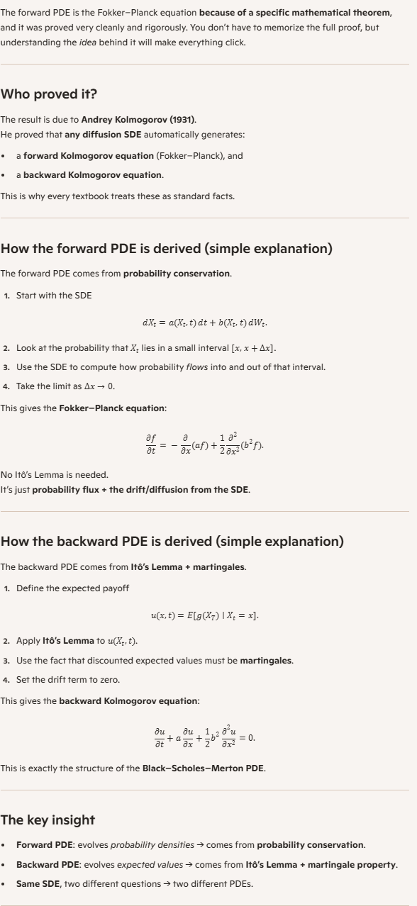
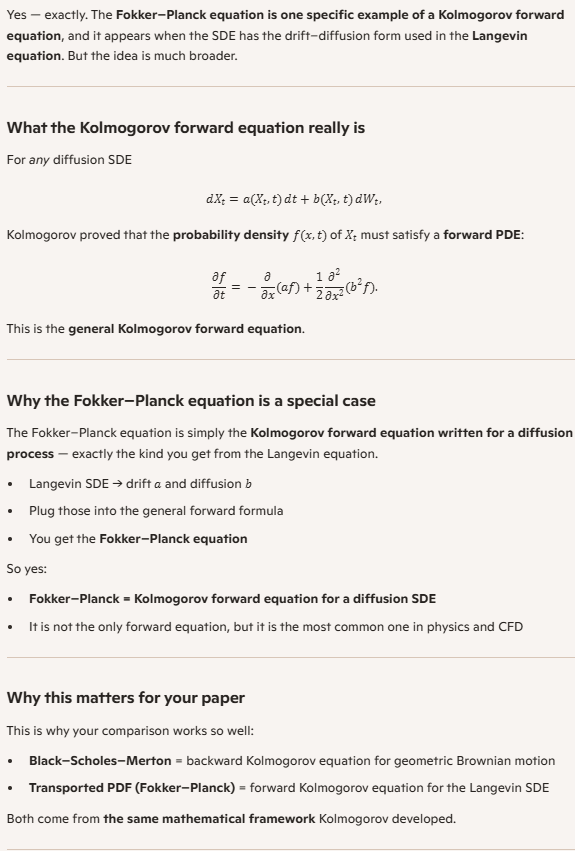

🌱 What an SDE is (in simple terms)
A typical SDE looks like:

Each part has a clear meaning:

𝑎
(
𝑋
𝑡
,
𝑡
)
 
𝑑
𝑡
 — the drift: how the system would evolve if there were no randomness.

 — the diffusion: how random noise pushes the system around.

So an SDE describes a process whose future is partly predictable (drift) and partly random (diffusion).
Examples include stock prices, particle motion in fluid, neuron firing models, and many physical or financial systems.

🎲 Why an SDE has an associated probability density
Even though an SDE produces a single random path when simulated, the underlying process is probabilistic. At any time 
𝑡
, the value 
𝑋
𝑡
 is not a fixed number but a random variable.

Because of this:

𝑋
𝑡
 has a distribution (e.g., normal, lognormal, etc.).

That distribution can often be described by a probability density function 
𝑝
(
𝑥
,
𝑡
)
.

The key idea is:

The randomness in the SDE means that the system can end up in different states with different probabilities, and the density 
𝑝
(
𝑥
,
𝑡
)
 describes how likely each state is.

For many SDEs, the density evolves according to the Fokker–Planck equation (also called the forward Kolmogorov equation):

∂
𝑝
∂
𝑡
=
−
∂
∂
𝑥
(
𝑎
(
𝑥
,
𝑡
)
𝑝
)
+
1
2
∂
2
∂
𝑥
2
(
𝑏
(
𝑥
,
𝑡
)
2
𝑝
)
.
This equation tells you how the probability density “flows” over time.

🧠 A simple intuition
Think of dropping a leaf into a turbulent river:

The drift is the average flow of the river.

The diffusion is the turbulence pushing the leaf unpredictably.

If you drop many leaves, they won’t all end up in the same place — they spread out.

That spread is exactly what the probability density describes.

An SDE describes the motion of a single leaf, but the density describes what happens if you imagine many possible realizations.

Yes — the Fokker–Planck equation tells you exactly how the probability density of an SDE changes over time, and the river analogy is a perfect way to understand it. Let’s build the intuition cleanly and connect it to the math.

📘 1. The Fokker–Planck equation describes how the density evolves
For an SDE

𝑑
𝑋
𝑡
=
𝑎
(
𝑋
𝑡
,
𝑡
)
 
𝑑
𝑡
+
𝑏
(
𝑋
𝑡
,
𝑡
)
 
𝑑
𝑊
𝑡
,
the probability density 
𝑝
(
𝑥
,
𝑡
)
 of 
𝑋
𝑡
 satisfies

∂
𝑝
∂
𝑡
=
−
∂
∂
𝑥
 ⁣
(
𝑎
(
𝑥
,
𝑡
)
 
𝑝
(
𝑥
,
𝑡
)
)
+
1
2
∂
2
∂
𝑥
2
 ⁣
(
𝑏
(
𝑥
,
𝑡
)
2
 
𝑝
(
𝑥
,
𝑡
)
)
.
This equation tells you:

how drift 
𝑎
 pushes probability mass around (like the river’s average flow), and

how diffusion 
𝑏
 spreads probability out (like turbulence).

So yes — the Fokker–Planck equation is literally the mathematical description of how the density changes over time.

🌊 2. The river analogy: turbulence downstream
Imagine dropping many leaves into a river at the same point.

Drift = average flow
If the river flows steadily to the right, the center of the cloud of leaves moves right.
This corresponds to the term:

−
∂
∂
𝑥
(
𝑎
𝑝
)
.
It shifts the density.

Diffusion = turbulence
If the river is turbulent, the leaves spread out.
This corresponds to:

1
2
∂
2
∂
𝑥
2
(
𝑏
2
𝑝
)
.
It widens the density.

What if turbulence changes downstream?
If turbulence increases downstream, then 
𝑏
(
𝑥
,
𝑡
)
 is larger in that region.
The diffusion term becomes stronger, and the density spreads out faster.

If turbulence decreases, the diffusion term weakens, and the density spreads more slowly.

So the Fokker–Planck equation captures exactly this:
how the randomness changes with position and time, and how that affects the spread of probability.

🍃 3. “One leaf vs. many leaves”: why this distinction matters
An SDE describes the motion of one leaf:

You simulate it once → you get one random path.

Simulate again → you get a different path.

But the density describes all possible leaves at once:

If you imagine dropping infinitely many leaves, each following the same SDE,
the cloud of leaves forms a shape.

That shape is the probability density 
𝑝
(
𝑥
,
𝑡
)
.

So:

SDE = individual randomness

Fokker–Planck = collective behavior of all possible outcomes

This is the same distinction as:

following one person’s random walk vs.

describing the distribution of a whole crowd.

🔍 4. A deeper intuition: why the density must evolve
Even if the drift stays the same, the diffusion term can cause:

spreading,

flattening,

sharpening,

shifting,

or even splitting of the density.

The Fokker–Planck equation is the rule that governs all of this.

What Pope starts with: the joint PDF
From the SDE system for a particle’s position 
𝑋
∗
(
𝑡
)
 and velocity 
𝑈
∗
(
𝑡
)
, Itô calculus gives a Fokker–Planck equation for the joint PDF

𝑓
𝐿
∗
(
𝑥
,
𝑢
,
𝑡
)
,
which is the probability density of finding a particle at position 
𝑥
 with velocity 
𝑢
 at time 
𝑡
.

This is a PDF in six variables (3 for 
𝑥
, 3 for 
𝑢
).

What Pope actually wants: the velocity PDF at a point
In turbulence modeling, we care about the velocity distribution at a given spatial point. That is the Eulerian velocity PDF

𝑓
(
𝑢
,
𝑥
,
𝑡
)
.
This is the conditional PDF:

𝑓
(
𝑢
,
𝑥
,
𝑡
)
=
𝑃
(
𝑈
=
𝑢
∣
𝑋
=
𝑥
)
.
To get this from the joint PDF, you use the identity:

𝑓
(
𝑢
,
𝑥
,
𝑡
)
=
𝑓
𝐿
∗
(
𝑥
,
𝑢
,
𝑡
)
𝑓
𝑋
∗
(
𝑥
,
𝑡
)
.
This is just the definition of a conditional probability density.

What is 
𝑓
𝑋
∗
(
𝑥
,
𝑡
)
?
It is the marginal PDF of particle position:

𝑓
𝑋
∗
(
𝑥
,
𝑡
)
=
∫
𝑓
𝐿
∗
(
𝑥
,
𝑢
,
𝑡
)
 
𝑑
𝑢
.
Physically, it tells you how likely it is to find a particle at position 
𝑥
, regardless of its velocity.

In a statistically stationary, homogeneous flow, this might be uniform.
In general flows, it is not.

Why Pope divides by 
𝑓
𝑋
∗
Because the Fokker–Planck equation he first derives describes the evolution of the joint PDF 
𝑓
𝐿
∗
(
𝑥
,
𝑢
,
𝑡
)
. But the turbulence model is formulated in terms of the Eulerian velocity PDF, which is the conditional PDF of velocity at a point.

To convert joint → conditional, you divide by the marginal:

𝑓
(
𝑢
,
𝑥
,
𝑡
)
=
𝑓
𝐿
∗
(
𝑥
,
𝑢
,
𝑡
)
𝑓
𝑋
∗
(
𝑥
,
𝑡
)
.
This step is not optional—it is the only way to extract the velocity PDF from the particle PDF.

Why this matters physically
The SDE describes one particle’s random motion.

The Fokker–Planck equation describes the distribution of many particles in phase space.

Dividing by 
𝑓
𝑋
∗
 extracts the velocity distribution at a specific location, which is what turbulence models use.

Without dividing by 
𝑓
𝑋
∗
, you would be modeling the wrong PDF.

Yes — once you write the turbulent‑particle velocity as an SDE of the form

𝑑
𝑈
∗
(
𝑡
)
=
𝑎
(
𝑈
∗
(
𝑡
)
,
𝑋
∗
(
𝑡
)
,
𝑡
)
 
𝑑
𝑡
+
𝑏
(
𝑋
∗
(
𝑡
)
,
𝑡
)
 
𝑑
𝑊
(
𝑡
)
,
the next step is to use Itô calculus to derive the Fokker–Planck equation, which governs how the probability density function of 
𝑈
∗
 evolves in time. This is exactly what Pope means.

How the SDE leads to the Fokker–Planck equation
The SDE describes one particle’s random trajectory.
The Fokker–Planck equation describes how the probability distribution of many such particles evolves.

These two descriptions are mathematically linked:

The SDE gives the microscopic dynamics (random paths).

The Fokker–Planck equation gives the macroscopic dynamics (PDF evolution).

Itô’s formula is the bridge between them.

What Itô calculus does in this context
Itô calculus lets you compute how the expected value of any function of the stochastic process evolves. When you apply Itô’s formula to a test function 
𝑓
(
𝑈
,
𝑡
)
 and then integrate by parts, you obtain the PDE for the probability density 
𝑝
(
𝑢
,
𝑡
)
.

For an SDE of the form

𝑑
𝑈
=
𝑎
(
𝑈
,
𝑡
)
 
𝑑
𝑡
+
𝑏
(
𝑈
,
𝑡
)
 
𝑑
𝑊
,
the corresponding Fokker–Planck equation is

∂
𝑝
∂
𝑡
=
−
∂
∂
𝑢
(
𝑎
 
𝑝
)
+
1
2
∂
2
∂
𝑢
2
(
(
𝑏
𝑏
𝑇
)
 
𝑝
)
.
In vector form, this becomes the standard multidimensional Fokker–Planck equation used in turbulence modeling.

Why Pope emphasizes “sufficiently general”
Because any generalized Langevin model can be written as

𝑑
𝑈
=
𝑎
 
𝑑
𝑡
+
𝑏
 
𝑑
𝑊
,
and for any SDE of that form, Itô calculus guarantees a corresponding Fokker–Planck equation. This means:

the GLM can always be translated into a PDF equation,

the PDF equation can always be translated back into an SDE,

the two descriptions are mathematically equivalent.

This equivalence is the foundation of Lagrangian PDF methods in turbulence.

Why this matters in turbulence modeling
The SDE describes the motion of a single fluid particle.
The Fokker–Planck equation describes the evolution of the velocity PDF, which is what Pope uses to model turbulent flows.

So yes — you write the SDE, then apply Itô calculus, and you obtain the Fokker–Planck equation that governs the PDF.

Is there a specific part of the derivation you want to see in more detail — the Itô step, the integration by parts, or the final form of the PDF equation?

1. Joint probability density
𝑓
𝐿
∗
(
𝑥
,
𝑢
,
𝑡
)
This is the joint PDF of position and velocity.

It answers:

“What is the probability that a particle is at position 
𝑥
 and has velocity 
𝑢
 at time 
𝑡
?”

It lives in 6‑dimensional space (3 for position, 3 for velocity).
This is the PDF that comes directly from the Fokker–Planck equation derived from the SDEs.

Physical meaning:  
It describes the full distribution of particles in phase space.

2. Marginal probability density
𝑓
𝑋
∗
(
𝑥
,
𝑡
)
This is the position-only PDF, obtained by integrating out velocity:

𝑓
𝑋
∗
(
𝑥
,
𝑡
)
=
∫
𝑓
𝐿
∗
(
𝑥
,
𝑢
,
𝑡
)
 
𝑑
𝑢
.
It answers:

“How likely is it to find a particle at position 
𝑥
, regardless of its velocity?”

Physical meaning:  
It tells you how particles are spatially distributed.

3. Conditional probability density
𝑓
∗
(
𝑢
,
𝑥
,
𝑡
)
This is the velocity PDF at a given position:

𝑓
∗
(
𝑢
,
𝑥
,
𝑡
)
=
𝑃
(
𝑈
=
𝑢
∣
𝑋
=
𝑥
)
.
It answers:

“Given that a particle is at position 
𝑥
, what is the probability that its velocity is 
𝑢
?”

This is the PDF used in turbulence modeling because we care about the velocity distribution at a point in space.

How they relate
These three PDFs are connected by the basic rule of conditional probability:

𝑓
𝐿
∗
(
𝑥
,
𝑢
,
𝑡
)
=
𝑓
∗
(
𝑢
,
𝑥
,
𝑡
)
 
𝑓
𝑋
∗
(
𝑥
,
𝑡
)
.
Solving for the conditional PDF gives:

𝑓
∗
(
𝑢
,
𝑥
,
𝑡
)
=
𝑓
𝐿
∗
(
𝑥
,
𝑢
,
𝑡
)
𝑓
𝑋
∗
(
𝑥
,
𝑡
)
.
This is exactly the step Pope performs.

Why Pope divides by 
𝑓
𝑋
∗
Because the Fokker–Planck equation gives him the joint PDF 
𝑓
𝐿
∗
, but the turbulence model needs the velocity PDF at a point, which is the conditional PDF 
𝑓
∗
.

To get conditional from joint, you must divide by the marginal.